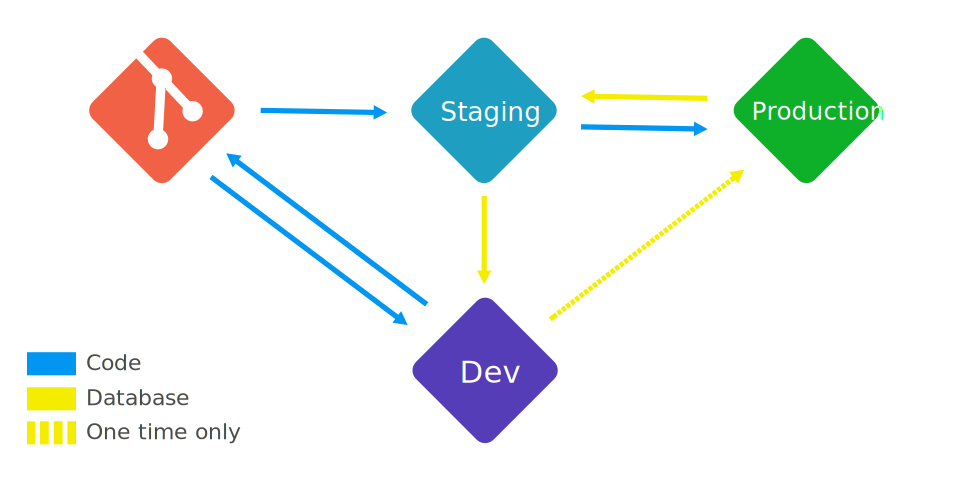

  

    
Hey guys, I just want to share with you my thoughts, techniques and experience while working with WordPress from angle of an intermediate PHP developer in a simple mind. Hope it can help you, especially the beginners, find out a correct path to approach the WordPress world.

    
If you find out any mistake or what I'm missing, please <a href="mailto:wordpressstack@gmail.com?Subject=WordPress%20Stack">shoot me an email</a>!

  

  

    <table>
      <caption>Table of contents</caption>
      <tr><th><a href="#wordpress-the-good-parts">1. WordPress the good parts</a></th></tr>   
      <tr><th><a href="#wordpress-the-bad-parts">2. WordPress the bad parts</a></th></tr>            
      <tr><th><a href="#wordpress-and-modern-php">3. WordPress and modern PHP</a></th></tr>
      <tr><th><a href="#wordpress-without-the-loop">4. WordPress without the loop</a></th></tr>
      <tr><th><a href="#wordpress-project-from-scratch">5. WordPress project from scratch</a></th></tr>
    </table>
     |
    
  

## 1. WordPress the good parts

### 1.1. Usability

WordPress UI is so friendly that everyone can master it quickly. In addition, there're many page-builder tools and customizer API which make it extra friendly for end user.

### 1.2. Flexibility

WordPress is famous for its flexibility by an enormous library of hooks, themes and plugins. You can use it for a blog, a small shop, a simple forum or even intranet sites of your company.

### 1.3. Configurations

If you have deployed or maintained some WordPress apps, you should have found out how powerful is the `wp-config.php` file. You can see [editing wp-config.php](https://codex.wordpress.org/Editing_wp-config.php) for more info. There're many really really well-planned constants.

## 2. WordPress the bad parts

### 2.1. Insecure platform

WordPress core is basically secure but low quality themes, 3rd plugins, entry level of programmer and users who lack of knowledge about security... are still big security holes in WordPress ecosystem.

### 2.2. Low level of abstraction

Dive into WordPress, you will see how tightly things are connected. There're too many assumptions which make you feel like you have to solve a half solved problem of someone else before solving your problem. Well, how ridiculous it is: creating a problem then try to fix it by creating a half built solution.

### 2.3. Messy code with ridiculous best practices

Dive into WordPress, you will also find out a lot of [premature optimization](http://c2.com/cgi/wiki?PrematureOptimization), unnecessary re-computation, backwards compatibility, [spaghetti code](https://en.wikipedia.org/wiki/Spaghetti_code), inconsistent conventions and a clumsy [event-driven architecture](https://en.wikipedia.org/wiki/Event-driven_architecture)...

So, now you know, WordPress is good for [end user](https://en.wikipedia.org/wiki/End_user) and bad for developers. But that's none of our business. It works so client doesn't care. It's easy so entry level programmer doesn't matter. WordPress is for everyone, not just developers. Don't underestimate how important it is for average users who just want some business utilities which are easy to use. The real business for developers is: **Writing the efficient themes and plugins which are maintainable and expandable**.

## 3. WordPress and modern PHP

WordPress is over 13 year old and its legacy coding style is still a big drawback. Let's see what modern concepts we could integrate into WordPress:

### 3.1. Interfaces

WordPress should have had interfaces, let's break WordPress apart:

  - WordPress has themes and plugins. We can treat them as components.
  - WordPress has admin UI which contains many boxes like meta boxes, setting sections...
  - WordPress has content types such as post types, taxonomies, settings...

There're other parts but for illustration, I just want to keep the list simple.

#### Components' interface


<?php namespace Wordpress\Interfaces;
/**
 * iComponent
 *
 * Components must provide methods to activate, deactivate, install and uninstall themselves.
 *
 * ## Ideally:
 * - On activation, components may prepare everything for installation but should not provide any real functionality and UI on activation.
 * - On installation, components should make sure that all functionality, data and UI are available.
 * - On deactivation, components should remove all functionality and UI but should not remove any data.
 * - On uninstallation, components should make sure that all functionality, UI and data are removed completely.
 */
interface iComponent
{
  /**
   * Do activation
   *
   * Recommended for `register_activation_hook()` or `after_switch_theme` hook.
   */
  function activate();

  /**
   * Do deactivation
   *
   * Recommended for `register_deactivation_hook()` or `switch_theme` hook.
   */
  function deactivate();

  /**
   * Do installation
   *
   * Recommended for `plugins_loaded` or `after_setup_theme` hook.
   */
  function install();

  /**
   * Do uninstallation
   *
   * !NOTICE: Only static methods are acceptable for plugins' uninstallation hook.
   *
   * Note that theme uninstallation is not available yet.   
   * Recommended when deleting components. E.g: `register_uninstall_hook`.
   */
  static function uninstall();
}



#### Boxes' interface


<?php namespace Wordpress\Interfaces;
/**
 * iBox
 *
 * Boxes must provide methods to add/remove themselves.
 */
interface iBox
{
  /**
   * Add a box
   */
  function add();

  /**
   * Remove a box
   */
  function remove();
}


#### Content types' interface


<?php namespace Wordpress\Interfaces;
/**
 * iContent
 *
 * Content types must provide methods to register/unregister themselves.
 */
interface iContent
{
  /**
   * Register content type
   */
  function register();

  /**
   * Unregister content type
   */
  function unregister();
}



If you want to see those interfaces and modern concepts in action, you can check out [pho theme](https://github.com/wpstack/pho) and [banhmi plugin](https://github.com/wpstack/banhmi).

### 3.2. Autoloading

It might be impossible to autoload WordPress core but we can autoload themes and plugins easily. It just depends on how you construct your themes and plugins. If you don't use Composer's autoloading mechanism, you can follow [this example](http://www.php-fig.org/psr/psr-4/examples/) to create your own one.

### 3.3. Dependency inversion

We can do this straightforwardly. For example:


<?php namespace Wordpress;
/**
 * ThemeName
 */
class ThemeName
{
  /**
   * Version
   */
  const VERSION = '1.0.0';

  /**
   * Script manager
   *
   * @var  object
   */
  private $script_manager;

  /**
   * Constructor
   */
  function __construct(\WP_Scripts $script_manager)
  {
    $this->script_manager = $script_manager;
  }

  /**
   * Register scripts
   *
   * @uses  \WP_Scripts::add()
   */
  private function registerScripts()
  {
    $suffix = SCRIPT_DEBUG ? '.js' : '.min.js';

    $this->manager->add('foo', {uri_to_foo_script} . $suffix, [], self::VERSION, 1);
    $this->manager->add('bar', {uri_to_bar_script} . $suffix, ['foo'], self::VERSION, 1);    
  }
}


## 4. WordPress without the loop

Personally, I have no idea why I should use [the loop](https://codex.wordpress.org/The_Loop). If you have ever stuck at [pagination problem](http://wordpress.stackexchange.com/questions/tagged/pagination?sort=votes&pageSize=15), the loop is behind it. Go deep inside, there're also many smelly things.

Other thing I don't want to use is the [template tags](https://codex.wordpress.org/Template_Tags). For me, it just wrappers for global variables which created around the loop. The only must-have template tag is [the_content()](https://developer.wordpress.org/reference/functions/the_content/) in which WordPress renders many important stuff with [the_content](https://developer.wordpress.org/reference/hooks/the_content/) filter. But we can call that filter directly.

So, what will you lost if you don't use the loop and the template tags? The only thing I cannot reinvent is paginated posts with [wp_link_pages()](https://developer.wordpress.org/reference/functions/wp_link_pages/) because it depends too much on global variables. But, in return, your code looks clean, readable and maintainable.

You can check out [pho theme](https://github.com/wpstack/pho) to see how it works. The core idea behind this is: using the `$wp_query` as a [DTO](https://en.wikipedia.org/wiki/Data_transfer_object).

## 5. WordPress project from scratch

### 5.1. An efficient and repeatable workflow

This is first thing you should consider when start a new project. Nowadays, a project must be optimized for [**continuous delivery**](https://en.wikipedia.org/wiki/Continuous_delivery). The key of it is an efficient and repeatable workflow. Do you remember that old day of [Cowboy coding](https://en.wikipedia.org/wiki/Cowboy_coding)? - lack of estimation and quick dirty fixes make technical debt exceed customer profitability.

This is a workflow which I use for recent projects:

**There're some rules in this workflow**:

  - Source code is maintained in a Git server and database is maintained in a production server. After source code and database has been built successfully, they should be shipped to staging server automatically. Many [CI](https://en.wikipedia.org/wiki/Continuous_integration) containers help to do that, such as [Jenkins](https://jenkins.io), [Dockers](https://www.docker.com) or [Travis](https://travis-ci.org)...
  - From dev to production, source code should always go up (push) and database should always go down (pull). This process is to make sure that we always deliver latest version of code and use latest version of database.
  - To avoid mistakes and unwanted delays, dev server should never interact with production server directly. The only exception is, because database is always neutral and adaptable, it's fine to push it directly from dev server to production server on the very first time.
  - You must have permission to access the production server.

In fact, you can use this workflow for any web projects. All tasks in the workflow can be done with [WP-CLI](http://wp-cli.org), shell scripts, cron jobs and SSH related commands. [Trellis](https://roots.io/trellis/) has awesome [Ansible](https://www.ansible.com) playbooks for that tasks.

### 5.1. Scalability

If the project is a long-term support, you should ask clients about whether they want to scale this project in the future or not. You can charge them more but you should definitely ask them out. WordPress has many bottlenecks for a [highly available](https://en.wikipedia.org/wiki/High_availability) system. When it's too late, you can't just throw hardware at the problem and expect it to be fixed!

The biggest challenge while scaling an WordPress application is the database. WordPress database schema isn't built for large scale application in the first place. The atrocious Entity-Attribute-Value table schema forces all content types to live together in the same few tables. And when the tables are large enough, it will make even proper relational data queries become [queries of death](https://www.scalewp.io/query-performance/#gfm-3).

### 5.2. End user capability

In a long-term support, maintaining a production application where end users can install themes and plugins is always a nightmare! If clients don't require those capabilities, you should disable it completely.

If you want to know more about how I start a new project, you can check out [wp-scratch](https://github.com/wp-scratch) - a highly flexible WordPress application skeleton.
